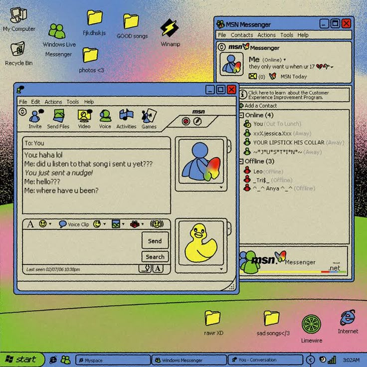
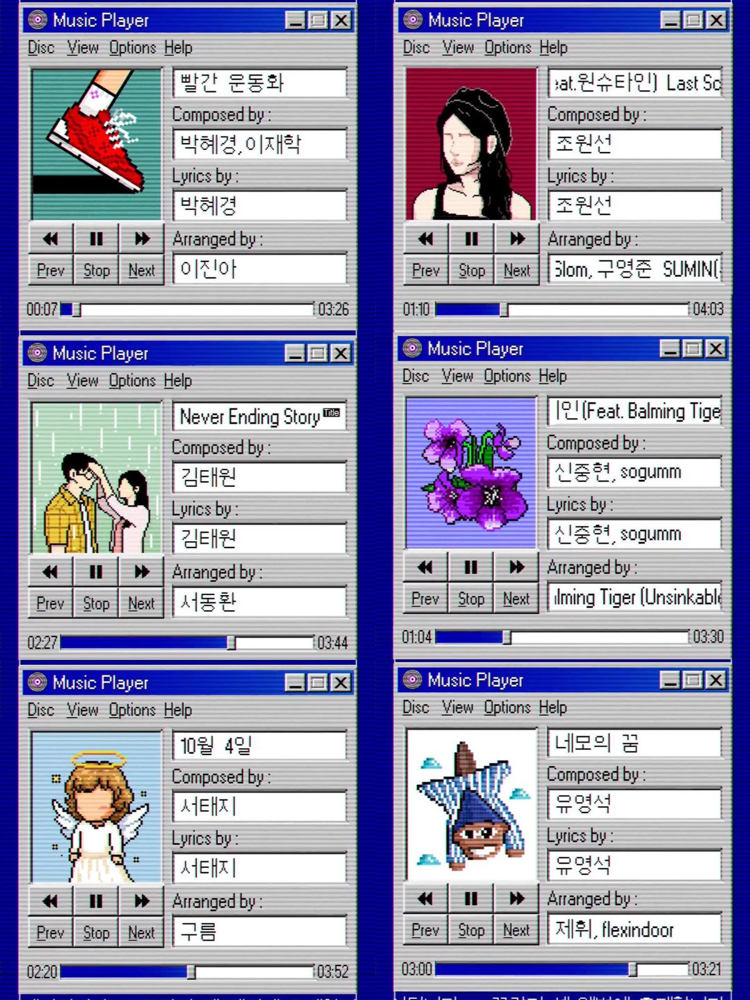
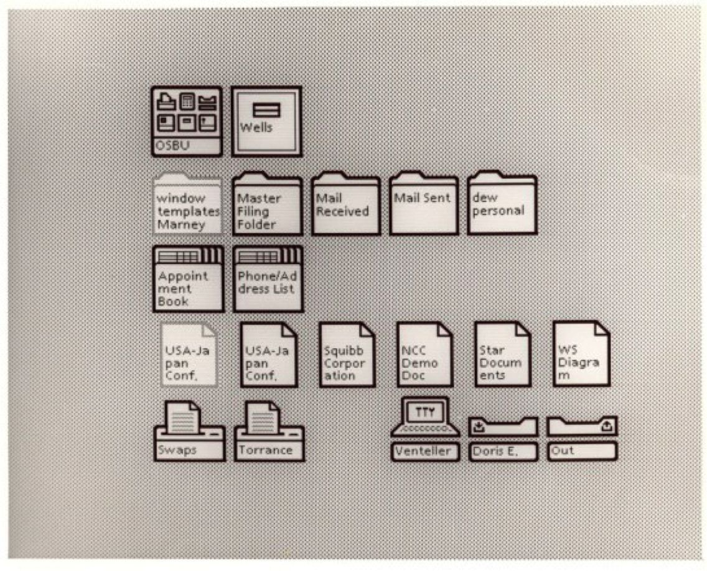

# My very first blog 🦞

## Struct

```text
├── public/
├── src/
│   ├── assets/
│   ├── components/
│   ├── content/
│   ├── layouts/
│   └── pages/
├── astro.config.mjs
├── README.md
├── package.json
└── tsconfig.json
```
# Sfeerfoto's




Dit zowel mijn portfolio site en blog.
Veel animatie en transitions
-> misschien nog een easter egg met 3d maken? 

# TODOs be4 19 June

- [x] Heel sicke loader maken
- [ ] Add noise SVG filter animation
- [ ] Make homepage -> moet zeg maar ook echt een desktop voorstellen...
- [ ] Transitions from homepage to other pages with View Transition API
- [ ] Pick font
- [ ] Add dark mode
- [ ] Responsive
- [ ] Give it more...vibe
- [ ] Fix all typos
- [ ] Micro animations
- [x] Make other pages vakken/leerdoelen
- [x] Maak eigen context menu -> html,css,js

# WIP
- [x] Heel sicke loader maken
- [ ] Add noise SVG filter animation -> meer contrast nodig


## Credit

This theme is based off of the lovely [Bear Blog](https://github.com/HermanMartinus/bearblog/).
